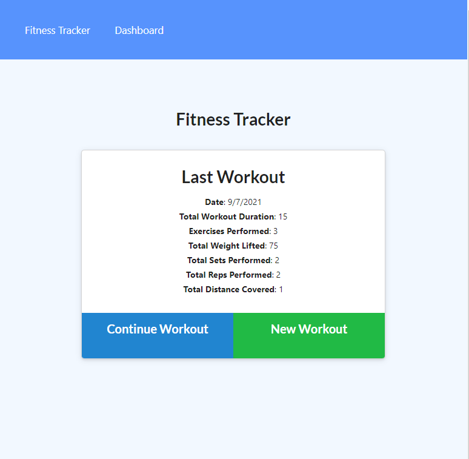

# Workout Tracker App

## By: David Lucio

<a name="back"></a>
### Table of Contents

* [Installation](#installation)
* [Contributing](#contributing)
* [Questions](#questions)

&nbsp;

[](https://opensource.org/licenses/MIT)

&nbsp;

> ## **Description**<br/>
> A Workout/Fitness tracking app, developed for UW Coding Bootcamp. This app uses NoSQL for storage.<br/>
> 
> &nbsp;
>
> ## **Tech used**<br/>
> Node.js, HTML, CSS, NoSQL  
> <br/>

*Completed Assignment*: [Deployment Link](https://davidlucio-hw18.herokuapp.com/)



&nbsp;

<a name="installation"></a>
## **Installation**  
```
npm i
npm run seed
npm run start
```  

&nbsp;

<a name="contributing"></a>
## **Contributing**
Clone the repository separately, and contact david.a.lucio@gmail.com for other contribution requests.  

&nbsp;

<a name="questions"></a>
## **Questions**  

Email: david.a.lucio@gmail.com

GitHub: [davidlucio](http://github.com/davidlucio)  

LinkedIn: [davidlucio](https://www.linkedin.com/in/davidlucio)